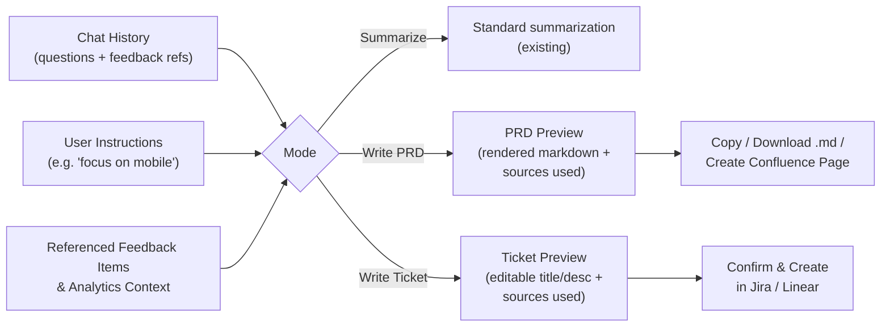

# Configurable Sources & Interaction Modes

## Current State

- **AI:** Only Gemini via `[lib/gemini.ts](lib/gemini.ts)` — `generateWithGemini(systemPrompt, userPrompt, overrideKey?)`
- **Analytics:** Only Pendo via `[lib/pendo.ts](lib/pendo.ts)`
- **Tickets:** Atlassian Jira read-only in `[lib/atlassian.ts](lib/atlassian.ts)` — no ticket creation
- **Interaction:** Single chat mode in `[components/chat-interface.tsx](components/chat-interface.tsx)`, all queries treated as feedback summarization

---

## 1. AI Provider Abstraction

**New file: `lib/ai-provider.ts`**
Common interface + dispatcher:

```typescript
export interface AIProvider {
  generate(systemPrompt: string, userPrompt: string, key?: string, model?: string): Promise<string | null>
  listModels?(key?: string): Promise<string[]>
}
export function getAIProvider(type: 'gemini' | 'anthropic' | 'openai'): AIProvider
```

**New files:** `lib/anthropic.ts`, `lib/openai.ts` — each implementing the interface using `@anthropic-ai/sdk` and `openai` npm packages.

**Model selection per provider:**

All three providers expose a models-list API, so we can dynamically populate a dropdown for each.

- **Gemini:** Keep the existing auto-resolve behavior as the default. Additionally show a model dropdown populated from the Gemini API; if the user selects one explicitly, skip auto-resolve and use it directly.
- **OpenAI:** Call `GET /v1/models`, filter to chat-capable GPT models, populate a dropdown. Default: `gpt-4o`.
- **Anthropic:** Call `GET /v1/models` (now available), populate a dropdown. Default: `claude-sonnet-4-6-20250414`.

**New API route: `app/api/settings/models/route.ts`** — fetches available models for a given provider using the stored/passed key, returns the list to the settings UI.

**Update `[components/settings-dialog.tsx](components/settings-dialog.tsx)`:** After selecting a provider and entering a key, show a model selector (dropdown populated from the API for OpenAI; curated list for Anthropic; resolved display for Gemini).

**Update `[lib/api-keys.ts](lib/api-keys.ts)`:** Add `aiProvider`, `anthropicKey`, `openaiKey`, `aiModel` to the stored key shape and `buildKeyHeaders`.

**Update `[lib/agent.ts](lib/agent.ts)`:** Replace hardcoded `generateWithGemini` call with `getAIProvider(keys.aiProvider).generate(..., keys.aiModel)`.

**Update `[lib/insights-generator.ts](lib/insights-generator.ts)`:** Also calls `generateWithGemini` and `isGeminiConfigured` directly. Refactor `generateAIInsights` to accept the AI provider type + model so it uses the same abstraction.

---

## 2. Analytics Provider Abstraction

**New file: `lib/amplitude.ts`** — `getAmplitudeOverview()` and `getRelevantAmplitudeContext()` mirroring Pendo's interface.

**Update `[lib/data-fetcher.ts](lib/data-fetcher.ts)`:** Check which analytics provider is configured; call Pendo or Amplitude accordingly (same `AgentData.pendoOverview` field, or rename to `analyticsOverview`).

**Update settings dialog:** Add analytics provider selector (Pendo / Amplitude) + key field.

---

## 3. Ticket Provider Abstraction + Write Support

**New file: `lib/linear.ts`** — `getLinearIssues()` (read) + `createLinearIssue(title, description, teamId?)` (write).

**Update `[lib/atlassian.ts](lib/atlassian.ts)`:** Add `createJiraIssue(summary, description, projectKey)` using `POST /rest/api/3/issue`.

**New file: `lib/ticket-provider.ts`**
Common interface:

```typescript
export interface TicketProvider {
  getIssues(...): Promise<TicketIssue[]>
  createIssue(title: string, body: string, meta?: Record<string, string>): Promise<{ url: string; id: string }>
}
```

**New API route: `app/api/tickets/route.ts`** — `POST` to create a ticket via the configured provider; returns the created ticket URL.

**Update settings dialog:** Add ticket provider selector (Atlassian / Linear) + Linear API key field (Atlassian keys already stored).

---

## 4. Interaction Modes

The key design principle: PRD and ticket generation are **not separate chat sessions** — they synthesize the current conversation history plus all referenced feedback/analytics into a structured artifact. The user first explores feedback through normal chat, then promotes that context into a document.

**Flow:**




**Three modes** surfaced via a tab bar in the chat UI:

- **Summarize** — existing behavior, unchanged
- **Write PRD** — uses full conversation history + all cited feedback/analytics as grounding; user can add focus instructions before generating
- **Write Ticket** — same context input; produces a concise, actionable ticket draft; surfaces a "Create in [Jira/Linear]" button after generation

**Update `[components/chat-interface.tsx](components/chat-interface.tsx)`:**

- Add a mode tab bar (Summarize / Write PRD / Write Ticket) — switching mode does not clear conversation history
- **Accumulate sources across the conversation**: maintain a `Set` of all source IDs that have appeared in assistant responses. Send this accumulated list in PRD/Ticket requests so the server can include the full referenced context.
- In PRD/Ticket mode, the input placeholder changes to "Any specific focus or instructions?" to signal that context is already loaded from the conversation
- After a PRD/Ticket response, show a copy-to-clipboard button; Ticket mode additionally shows a **"Create in [Jira/Linear]" button that opens an inline edit form** (editable title + description fields pre-filled from the AI output) before submission
- Suggested queries are mode-specific

**Update `[lib/agent.ts](lib/agent.ts)`:**

- Accept `mode: 'summarize' | 'prd' | 'ticket'` in the `chat()` function
- **In PRD/Ticket mode, use the full conversation history** (not the current 3-turn `slice(-3)` limit) plus all accumulated source IDs to look up and include the complete referenced feedback/analytics context
- PRD system prompt: structured output with Goals, Problem Statement, User Stories, Success Metrics, Open Questions
- Ticket system prompt: concise Title, Description, Steps to Reproduce (if bug) or Acceptance Criteria, Priority suggestion

**Update `app/api/chat/route.ts`:** Pass `mode` and `accumulatedSourceIds` from request body to `chat()`.

**Update `app/api/settings/validate` route:** Add validators for Anthropic (test `GET /v1/models`), OpenAI (test `GET /v1/models`), Amplitude (test API auth), and Linear (test GraphQL introspection query).

---

## 5. Security

The app moves from read-only to write-capable (ticket and Confluence page creation). New safeguards:

- **Content sanitization before write**: Strip Jira wiki injection patterns and unexpected markup from AI-generated content before POSTing to Jira/Linear/Confluence. Implement a `sanitizeForProvider(content, provider)` utility in `lib/ticket-provider.ts`.
- **Rate limiting on write endpoints**: `app/api/tickets/route.ts` and `app/api/documents/route.ts` enforce a cooldown (e.g. 1 creation per 10 seconds per session) to prevent accidental spam from double-clicks or automation loops.
- **Data destination transparency**: Two layers:
  - **Settings**: When selecting an AI provider, show a notice: "Your feedback data will be sent to [Google/Anthropic/OpenAI] for processing."
  - **Chat UI**: Persistent badge below the input showing the active AI provider (e.g. "Anthropic Claude Sonnet 4.6") — replaces the current "Gemini AI" / "Built-in" indicator.
- **Key storage**: New provider keys (Anthropic, OpenAI, Amplitude, Linear) use the same encrypted IndexedDB pattern already in `[lib/api-keys.ts](lib/api-keys.ts)`. No changes to the storage mechanism needed.
- **Write confirmation**: All write operations (create ticket, create Confluence page) require explicit user confirmation through the preview flow (see section 6).

---

## 6. Preview Flow

All generated artifacts go through a preview/edit step before any external action.

**Ticket preview:**

1. AI generates a ticket draft → rendered inline in chat as a structured card (Title, Description, Acceptance Criteria)
2. User clicks "Create in [Jira/Linear]" → opens an **inline edit form** with pre-filled fields (title, description, acceptance criteria, target project/team dropdown)
3. Below the form: **"Sources used"** collapsible section listing all feedback items referenced, so the user can verify grounding
4. "Confirm & Create" button fires the API call; success shows the ticket URL + link

**PRD preview:**

1. AI generates a PRD → rendered as formatted markdown inline in chat
2. Action bar beneath: "Edit" toggle (switches to raw markdown editor), "Copy to clipboard", "Download as .md"
3. If Atlassian is connected: "Create Confluence page" button → opens a mini-form to select the target Confluence space, then creates the page via `POST /wiki/api/v2/pages`
4. **"Sources used"** collapsible section for grounding verification

**New API route: `app/api/documents/route.ts`** — `POST` to create a Confluence page; accepts title, space key, and markdown body (converted to Atlassian Document Format server-side).

**Update `[lib/atlassian.ts](lib/atlassian.ts)`:** Add `createConfluencePage(title, spaceKey, body)` alongside the existing read functions.

---

## 7. AI Context Mode Updates

The current context mode setting (Focused / Standard / Deep) needs to be scoped correctly for the new modes.

**Change:** Context mode only applies to **Summarize** mode. PRD and Ticket generation always use full context automatically.

- **Update `[components/settings-dialog.tsx](components/settings-dialog.tsx)`:** Change the context mode description to: "Controls how much data is sent per chat query. PRD and ticket generation always use full context."
- **Update `[lib/agent.ts](lib/agent.ts)`:** When `mode` is `'prd'` or `'ticket'`, ignore `contextMode` and always use `buildDeepContext` with the full accumulated source set + complete conversation history.
- **Update `[components/chat-interface.tsx](components/chat-interface.tsx)`:** The status indicator below the input should show context mode for Summarize, and "Full context" when in PRD/Ticket mode.

---

## Key files changed

- `lib/gemini.ts` — unchanged (still used via new abstraction)
- `lib/agent.ts` — provider dispatch + mode-aware system prompts + full-history context assembly for PRD/Ticket
- `lib/insights-generator.ts` — refactor to use AI provider abstraction instead of direct Gemini calls
- `lib/data-fetcher.ts` — analytics provider dispatch
- `lib/api-keys.ts` — new keys: `aiProvider`, `aiModel`, `anthropicKey`, `openaiKey`, `analyticsProvider`, `amplitudeKey`, `ticketProvider`, `linearKey`
- `components/settings-dialog.tsx` — provider selectors + dynamic model dropdown
- `components/chat-interface.tsx` — mode tab bar + source accumulation + context-aware PRD/Ticket input + editable ticket creation form
- `app/api/chat/route.ts` — pass `mode` + `accumulatedSourceIds`
- `app/api/tickets/route.ts` — new (POST to create ticket)
- `app/api/settings/models/route.ts` — new (fetch model list per provider)
- `app/api/settings/validate/route.ts` — add validators for new providers
- `app/api/documents/route.ts` — new (POST to create Confluence page)
- `.env.example` — document new keys

